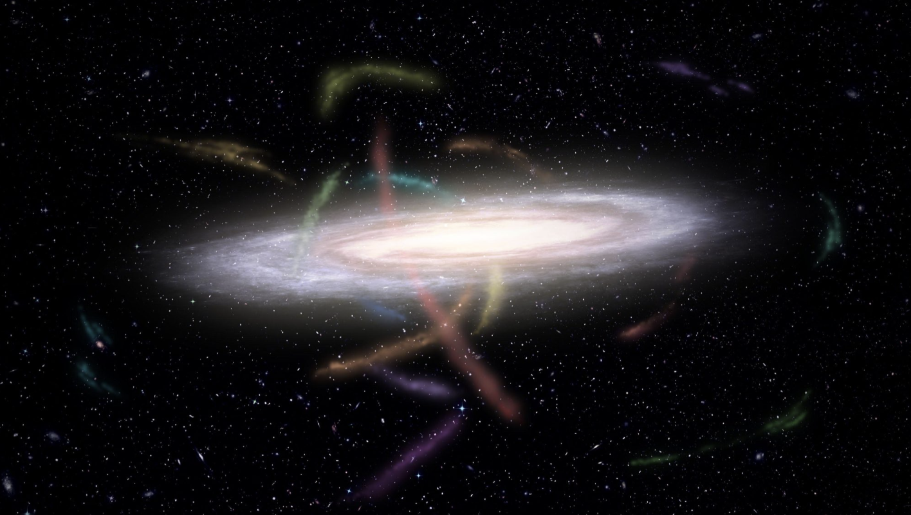
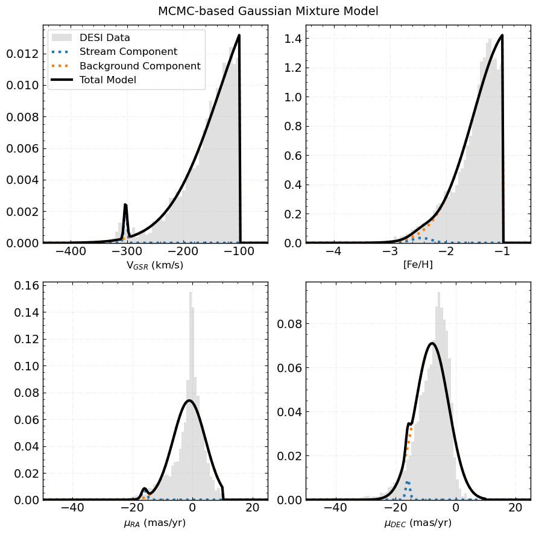

# DESI DR1 Stellar Catalogue Stream Tutorial
The tutorial notebook (`streamTutorial.ipynb`) will walk users through loading DESI Milky Way Survey data to look for new members of known stellar streams.

## Background
### Stellar Streams
Milky Way-like galaxies evolved hierarchically, accreeting mass through many mergers within a **dark matter** (DM) halo. Stellar streams are a result of this process; a host galaxy's potential disrupts satellites (dwarf galaxies, globular clusters) leading them to form tidal tails.

 

[Artist depiction of stellar streams in orbit around host galaxy | from S5 Collaboration]

Theories of cold and alternative DM *disagree* on predictions at the sub-galactic scale. Stellar streams offer a powerful means to indirectly constrain the DM substructure within the Milky Way. 

However, to do this we need robust membership counts for stellar streams within our Galaxy. There are multiple ways to approach characterizing streams, but in this tutorial you will be walked through using **finite mixture models** to disentagle stellar streams from surrounding stars.

### Mixture Modelling

Mixture models are powerful statistical to describe a set of datapoints that come from different distinct populations, even if we can't directly observe which data points belongs tow hich group.

In this tutorial, we will assume that the field of stars we narrow in on can be described by two distnict gaussian populations: one for the stream, and one for the 'background' (non-stream stars).



[Example truncated-Gaussain Mixture Model]


### MCMC
We have to fit for the best mixture of models, and to do that we use Bayesian statistics. 
$$P(\theta|D) = \frac{\mathcal{L}(D|\theta) \cdot P(\theta)}{P(D)}$$

Where $\mathcal{L}(D|\theta)$ is the likelihood function, $P(\theta)$ is the prior probability, and $P(D)$ is the evidence, with $\theta$ representing our model parameters and $D$ the observed data.

In natural language, Bayes' theorem reads as:

> The probability of our model parameters given our observed data is equal to the likelihood of the data given the model parameters multiplied by the prior probability of the model parameters, divided by the probability of the data.

In practice, we can mostly ignore the evidence term ($P(D)$) since it is a constant. 


To find the best-fitting parameters, we need to sample from the posterior distribution $P(\theta|D)$. This is where **Markov Chain Monte Carlo (MCMC)** comes in.

For mixture models, MCMC allows us to simultaneously fit:
- Stream population parameters (mean position, velocity dispersion, metallicity)
- Background population parameters
- Membership probabilities for each star

The chain explores regions of parameter space with higher posterior probability more frequently, giving us both best-fit values and uncertainty estimates.


## Get Started
### Clone this repository

Run the following terminal command in the directory you'll be working in.

```shell
git clone https://github.com/nassmohammed/DESI-DR1_streamTutorial.git
```

Included is
- `data/` - directory including small data files needed for this tutorial
  - `dotter/` - Stellar evolution models from Dotter et al. 2006
  - `sf3_only_table.csv` - overview table of STREAMFINDER streams
  - `streamfinder_gaiadr3.fits` - file including stars in STREAMFINDER streams (modified from Ibata et al. 2024)
- `*.py` - scripts powering the tutorial
- `streamTutorial.ipynb` - the main notebook you will be working with.
- `env.yml` - the file to setup the required python and package versions for this tutorail.

**Not included**
- `mwsall-pix-iron.fits` - [12 GB] DESI DR1 Stellar Catalogue data. See below how to download


### Download DESI DR1 Stellar Catalogue
You can download from  here (https://data.desi.lbl.gov/public/dr1/vac/dr1/mws/iron/v1.0/mwsall-pix-iron.fits) or from your terminal with:

```ssh
curl -o mwsall-pix-iron.fits https://data.desi.lbl.gov/public/dr1/vac/dr1/mws/iron/v1.0/mwsall-pix-iron.fits
```

Read [here](https://data.desi.lbl.gov/doc/releases/dr1/vac/mws/) for a general overview of the DESI DR1 stellar catalogue. The corresponding paper (Kosposov et al. 2025) can be found [here](https://ui.adsabs.harvard.edu/abs/2025arXiv250514787K/abstract).

If space is a concern for your device, contact `ting [dot] li [at] astro [dot] utoronto [dot] ca` to get set up on the Eridanus server (Only for participants at the 2025 EXPLORE summer school and research workshop at York University).

[Google collab](https://colab.research.google.com/drive/1tf9Opu2dVatyKhWVHd1HcKW3n0aVhzZq?usp=sharing) notebook for running on weaker laptops.

### Install Python Environment
In your cloned directory, run the following in your terminal:
```shell
conda env create -f env.yml 
```
This will set up the proper python environment to run this notebook.

## User tips & FAQ

### [Cheatsheets](https://www.astro.utoronto.ca/~nasser.mohammed/explore_summer_school.html)
Go to the above link to look at some example notebooks for finding streams.

### Plotting options
`background = True` option: show the background stars in the figure for reference.

`showStream = True` option: show STREAMFINDER stars, both those that have survived the cuts so far (as diaminds) and those cut out (as Xs)
`show_sf_only=False` option: shows STREAMFINDER stars that are NOT IN DESI as hollow diamonds. Useful when there are very few surviving SF stars in DESI

`show_initial(\optimized\mcmc)_splines = True` option: shows the respective spline track ontop of figure.

`plot_params`: A dictionary that allows you to change plotting properties withing adjusting the .py file.

Example usage:
```python
plt_kin.plot_params['sf_in_desi']['alpha'] = 0.5
plt_kin.plot_params['sf_in_desi']['zorder'] = 10
plt_kin.plot_params['background']['alpha'] = 0.2
plt_kin.plot_params['background']['s'] = 1
```

### Q: I don't see a stream in the kinematic plots, should I run the MCMC anyway?
A: Don't waste your time! If you have difficulty spotting a stream in the trimmed data, so will the MCMC walkers. Try to adjust your cuts and compare with the location of SF stars. 

### Q: How long will it take to run the MCMC?
A: It depends on your device. If you're set up on the Eridanus server, 5000 burn ins with 5000 iterations will take about 20 miuntes. On google collab, it takes about an hour. On an M3 Macbook pro it takes about 6 minutes.

### Q: How do I know if the MCMC found anything?
A: We print out some diagonstic plots to judge how well the MCMC did. First the chains are plotted, if it looks like they are hitting up against an invisible wall, your prior may be too restrictive! If it seems to never converge about one value, your priors may be too loose, or there may not be a stream there at all.

The second diagnostic plot is the corner plot. Your MCMC found something if the plots are generally symmetric about the means and have well-defined distributions.


# Bibliography

Foreman-Mackey, D., Hogg, D. W., Lang, D., & Goodman, J. (2013). emcee: The MCMC Hammer. Publications of the Astronomical Society of the Pacific, 125(925), 306. https://doi.org/10.1086/670067

Ibata, R., Malhan, K., Tenachi, W., Ardern-Arentsen, A., Bellazzini, M., Bianchini, P., Bonifacio, P., Caffau, E., Diakogiannis, F., Errani, R., Famaey, B., Ferrone, S., Martin, N. F., di Matteo, P., Monari, G., Renaud, F., Starkenburg, E., Thomas, G., Viswanathan, A., & Yuan, Z. (2024). Charting the Galactic Acceleration Field. II. A Global Mass Model of the Milky Way from the STREAMFINDER Atlas of Stellar Streams Detected in Gaia DR3. The Astrophysical Journal, 967(1), 89. https://doi.org/10.3847/1538-4357/ad382d

Koposov, S. E., Li, T. S., Allende Prieto, C., Medina, G. E., Sandford, N., Aguado, D., Beraldo e Silva, L., Byström, A., Cooper, A. P., Dey, A., Frenk, C. S., et al. (2025). DESI Data Release 1: Stellar Catalogue. arXiv preprint arXiv:2505.14787.

Mateu, C. (2023). galstreams: A library of Milky Way stellar stream footprints and tracks. Monthly Notices of the Royal Astronomical Society, 520(4), 5225–5258. https://doi.org/10.1093/mnras/stad321

# Acknowlegements


Thanks to the LSST-DA Data Science Fellowship Program, which is funded by LSST-DA, the Brinson Foundation, the WoodNext Foundation, and the Research Corporation for Science Advancement Foundation; participation in this program has benefited this work.

